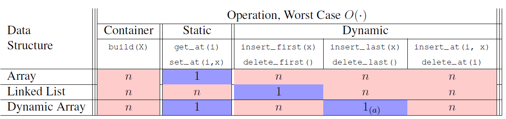
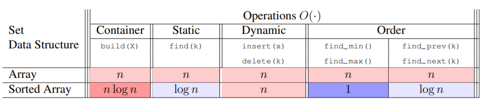

# Arrays
* Array values are stored in continguous memory
* Arrays elements should be explicitly (or by convention) of the same type
* Arrays have fixed capacity. Static arrays require manual resizing/reallocation. Dynamic arrays handle this automatically.
## Static Arrays [➕[C++](./cpp/array.cpp)]
* Declared with values & fixed memory allocation. Cannot exceed predefined size ➡ Mutate values but not insert/delete.
* To expand array: manually declare a larger (empty) array ➡ copy values across ➡ free memory of old array
* For optimal performance, array should be uniform element type
* ithElementAddress = StartAddress + [ElementSize * (i - i0)]
* Best for performing mathematical operations on numeric element types
* In Python: import `array` or `numpy` modules
* In C++: declare int arr[] or #include <array>

## Dynamic Arrays [🐍[Python](./py/dynamic_array.py)] [➕[C++](./cpp/array.cpp)]
* Initialized as empty array with initial size. When length of array == size of memory allocation ➡ expand array.
* To expand array: dynamically allocate memory for a larger (empty) array ➡ copy values across ➡ free memory of old array
* In Python: `list` behaves as a dynamic array. So list.append(), list.pop() are O(1) operations.

## Array implementation of Sequence/List Interface

## Array implementation of Set Interface

# Summary

* Static arrays are good when you need to select a value according to index (constant time random access) or performing efficient mathematical operations across a fixed numerical array.
* Dynamic arrays are prefered when you also need to append elements/change array size. However, this comes at the cost of allocated but unused memory.

### Resources:
* [MIT 6006 Lesson 2](./notes/MIT6006/02%20Sequences%20and%20Sets.pdf)