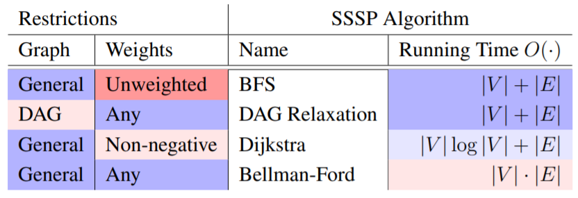

# Graphs

* Graph is a representation of a network/mesh/system consisting of nodes and edges
* G = {E,V} ➡ Set of edges and vertices
* Can be directed/undirected

## Graph Representations
|V| = number of nodes, |E| = number of edges, deg(i) = number of incident edges to node i

**Adjacency Matrix**
* DS: Matrix
* Space: O(|V|^2)
* Edge Retrieval: O(1) ➡ Access A(i,j) element
* Enumerate Neighbours: O(|V|) ➡ Iterate across row A(i,*)

**Adjacency List**
* DS: Direct Access Array, where A[i] ➡ [neighbours of node i]
* Space: O(|V| + |E|)
* Edge Retrieval: O(deg(i))
* Enumerate Neighbours: O(|V|) ➡ Iterate across neighbours at A[i]

**Adjacency Set/Map**
* DS: Hash Map, S[i] ➡ {neighbours of node i}
* Space: O(|V| + |E|)
* Edge Retrieval: O(1) ➡ is j in S[i]
* Enumerate Neighbours: O(|V|) ➡ Iterate across neighbours at S[i]

## Graph Search [🐍[Python](./py/graph.py)] [➕[C++](./cpp/graph)]
* Frontier = set of nodes to explore
* DAG = Directed Acyclic Graph

**Breadth-First Search (BFS)**
* "Wide and Shallow" search by level/layer
* FIFO ➡ Queue based frontier
* Using BFS we can determine the unweighted shortest path from i ➡ j

**Depth-First Search (DFS)**
* "As far as possible" search along node path, then backtrack
* LIFO ➡ Stack based frontier
* Using DFS we can determine the number of unique paths/end-points from node i

## Single-Source Shortest Path (SSSP) Algorithms

**Weighted Graphs**
* G = {E,V} + weight fxn W: e ➡ R
* Weight of an edge could model distance, resistance, strength of connection etc
* W(i,j) allows us to query weight of edge (i,j) in constant time O(1)

**SSSP**
* Input: Source index, src.key
* Output: Shorted path distance to all nodes, d = [d0, d1,..,dn]
* Where di = 0 for i = src.key, di = inf for unreachable node
### DAG Relaxation [🐍[Python](./py/dag.py)]

DAG Relaxation solves SSSP of DAG graphs (incl. with negative weights):

1. Initialise shortest path UB to infinity
2. Iterate through nodes in topological order
3. At each node, use weights of outbound edges to calculate optimal path by triangle inequality
4. If optimal path estimate <= to UB, update
5. Repeat for all edges in topographical order

Ouput: array d[] where d[u] = 0 and d[v] = weighted sum of optimal path from u to v

### Bellman-Ford [🐍[Python](./py/bellman_ford.py)]

* Initialize distance estimates, and then relax every edge in the graph |V|−1 times. 
* Recall, there are |V|-1 edges in a simple graph
* At termination, if any edge is still relaxable ➡ graph contains negative weight cycle
* Otherwise, d(s, v)= δ(s, v) for all v ∈ V -- i.e. have solved for shortest paths for each u to v

### Dijkstra's [🐍[Python](./py/dijkstra.py)]

* Used for non-negative weights only
* Repeatedly relaxes edges of the vertex that has smallest minimum weight path estimate
* Leverages a minimum priority queue interface of {node: distance estimate} k:v pairs
* Run time cost is proportional to PQ efficiency
* Implementations of the minimum PQ:
    * [Direct Access Array](./hash_tables.py)
    * [Binary Heap](./heaps.py)
    * Fibonacci Heap

### A* Search [🐍[Python](./py/a_star.py)]
* Informed implementation of Dijkstra
* Selects next node based on minimum cost estimate, f(n)
* f(n) = h(n) + g(n)
    * h(n): heuristic estimate of cost from current node to target
    * g(n): distance estimate from source node to current node
* More efficient than Dijkstra but cannot guarantee the optimal solution
* Dijkstra can be considered the special case of A* when h(n) = 0

## All-Pairs Shortest Path (APSP) Algorithms

### Johnson's [🐍[Python](./py/apsp.py)]

* Transform G{V,E,W} with negative weights (i.e. -w exists in W) into G' where all w >= 0, while preserving relative shortest path relationships:
    1. Construct Gs by adding auxillary super node with outgoing edge of weight = 0 to all other nodes
    2. Compute d for all v in V using Bellman-Ford/BFS
    3. If any di = inf, then negative weight cycle must exist ➡ abort!
    4. Else, contruct G' by reweighting each edge = w(u, v) + d[u] - d[v]
    5. Solve SSSP using Dijkstra for all (u,v) in V

### Floyd-Warshall

* Dynamic Programming solution to APSP

### Resources:
* [MIT 6.006 Lesson 9](./notes/MIT6006/09%20BFS.pdf)
* [MIT 6.006 Lesson 10](./notes/MIT6006/10%20DFS.pdf)
* [Stanford CS161 Lesson 9](./notes/StanfordCS161/09%20Graphs.pdf)
* [William Fiset's Graph Theory Playlist](https://www.youtube.com/playlist?list=PLDV1Zeh2NRsDGO4--qE8yH72HFL1Km93P)