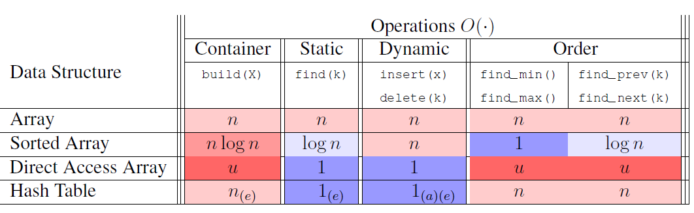

# Hash Tables [🐍[Python](./py/hash_table.py)]

* Recall, comparison based models (like binary trees) are constrained to log N search.
* To increase search speed, we need to apply a non-constant branching factor
* Insert, lookup, delete operations in O(1)

## Direct Access Array [🐍[Python](./py/direct_access.py)]
* Static array that stores the item at item.key index location (e.g. 5 inserted at arr[5])
* Requires unique keys and a slot available for every possible key
* For non-integer and large numeric values, the overhead memory requirements can exceed machine storage
* Insert, lookup, delete operations in O(1)

## Hash Functions and Hash Tables
* Let U be the set of keys we need to store
* Let n be the size of the direct access array
* Let h be the hash function (aka hash map) which reduces each key k ∈ U to an index value in [1:n]
    * h : U → {1, 2, . . . , n}
    * For example, h(x) = 13x +2 mod 5 ➡ h(1) = 0
* If U > n, multiple keys could map to the same hash index -- this is called a collision. 

## Collision Resolution
* Two key stratagies to accomodate colliding hash keys:
    1. Open addressing
    2. Chaining

**Open Addressing**
* Store collisions at a different address in the **same** direct access array
* Apply probing or secondary hash function to allocate to an open array space
* How most programming languages implement hashing in practice

**Chaining**
* Hash index holds a pointer to a chain/bucket, rather than a key
* The chain/bucket is a dynamic data structure such as array or linked list
* If x maps to bucket of size X, the time complexity of insert, delete, lookup is O(X)
* Therefore, our goal is to select hash functions which minimise the number of collisions
    1. Assume randomly distributed keys
    2. Assume random hash function

## Universal Hashing
* Assume the elements of the U are encoded as non-negative integers in the range {0, . . . , |U| − 1}
* Select a prime number p ≥ |U|
* The universal family of hash functions are given by:

    h(x) = (ax + b mod p) mod n
    
    where a, b ∈{0,...,p − 1} and a !=0

## Hash Table implementation of Set Interface

## Summary
* A hash table will perform dynamic set operations (insert, delete, find) in O(1) time given:
    1. Collisions are resolved using chaining
    2. Hash function is chosen randomly from a universal family
    3. The expectation is taken over the random choice of hash function, independent from the input keys

### Resources:
* [MIT 6.006 Lesson 4](./notes/MIT6006/04%20Hash%20Tables.pdf)
* [Stanford CS161 Lesson 8](./notes/StanfordCS161/08%20Hashing.pdf)