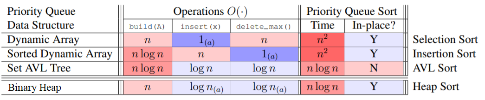

# Heaps [🐍[Python](./py/max_heap.py)]

* Priority Queue returns max(X)
* Bijection: convert level/depth order representation of a complete binary tree ↔ array  
* Implicit DS: no pointers, instead use array logic to find parent and children
* Heaps are complete binary trees which support max or min operations
* Heaps capture logarithmic performance of complete binary tree in an array based structure 

**Complete Binary Tree properties:**
1. 2**i nodes at depth i
2. At max depth nodes are left justified

**Max Heap properties:**
1. For node x at depth i, all nodes at depth j > i will have keys < x.key. In other words, node.key is > than all subtree keys
2. Therefore, root node is largest possible value
3. Get/delete max

**Min Heap properties:**
1. For node x at depth i, all nodes at depth j > i will have keys > x.key. In other words, node.key is < than all subtree keys
2. Therefore, root node is the smallest possible value
3. Get/delete min

## Heap Operations
* In both max/min trees, the value of interest is the root node
* Root node is 'hardest' to remove, right-most leaf node is the easiest (ie. array pop)

**Insert(x)**
* Add x as right-most leaf
* Recursively swap the node upwards, stopping before node.key < parent.key (max heap) or node.key > parent.key (min heap)

**Extract(max/min)**
* Swap last leaf and root keys
* Recursively propogate the root node downwards until stopping criteria is met
    * Max Heap: root.key > parent.key
    * Min Heap: root.key < parent.key

**Build(X)**
* Repeated insertion into a heap is O(n * log n)
* Instead, if all values are available, can build in reverse from the leafs to the root in O(n) time

## Priority Queues [🐍[Python](./py/priority_q.py)]

* Heaps are primarily used to implement Priority Queue interface
* Python: `heapq` library

### Resources:
* [MIT 6006 Lesson 8](./notes/MIT6006/08%20Heaps.pdf)
* [Stanford CS161 Lesson 7](./notes/StanfordCS161/07%20Heaps%20and%20BST.pdf)