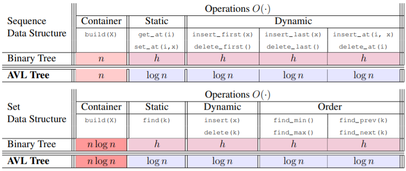

# Trees

* Trees are pointer based data structures, typically used to represent heirarchical data.
* The relative position of 2 nodes denotes their relationship. Like a family tree, nodes are called parents/children/siblings/decendents based on their relative position to each other. 
* Pointers between data nodes are refered to as edges
* Trees are a subset of graph which fit specific structural criteria
    * The tree has a single `root` node (node with no parent)
    * All other nodes must have exactly one parent node
    * Nodes with the same parent are called `sibling` nodes
    * Nodes without children are `leaf` nodes
    * The `depth` or `level` of any node is the length of the path (ie. number of edges between parent nodes) to the root node (top level)
    * The `height` of the tree is the level of the deepest leaf node 

## Binary Search Trees [🐍[Python](./py/bst.py)] [➕[C++](./cpp/bst/bst.cpp)] 

* Binary Trees have a maximum of 2 child nodes per parent node, where child.left < parent and child.right > parent
* All nodes to the right of any node should be greater than the node. To the left, all nodes are smaller.
* Each node stores a value and 3 pointers {val, parent, left, right}
* All node values should be unique
* Binary Search Trees are often used to implement abstract data types like sets and maps
* Binary Search Tree operations
    * `insert`
    * `find`
    * Traversals: `in_order`, `pre_order`, `post_order`
    * Search: `range_search`, `nearest_neighbours`
    * `delete`
    * `balance` -- rebuild tree to minimum possible height
* Quicksort ➡ Nodes equate to pivots, left subtree is arr < x.key, right subtree is arr > x.key

## Tree Traversal
* Depth-First (DFS):
    * Use recursive calls (stack) ➡ split into subtrees of node + descendants
    * In Order: traverse nodes from left ➡ root ➡ right (ie. smallest to largest)
    * Pre Order: traverse nodes from root ➡ left ➡ right
    * Post Order: traverse nodes from left ➡ right ➡ root
* Bredth-First (BFS):
    * Use enqueue, dequeue (queue ops)
    * Level Order: traverse top to bottom across levels

## Balanced Trees
* Goal is to maintain tree height O(log n) ➡ Balanced Tree
* Types:
    * Red-Black Trees
    * AVL Trees
    * Splay Trees
    * B-Trees
* Rotation = restructuring of local tree shape in O(1) time, while preserving traversal order

**AVL Trees  [🐍[Python](./py/avl.py)]**
* The `skew` for any given node is the difference in height between its left and right subtrees
* AVL enforces that skew must be -1, 0 or 1 (Height of empty subtree is -1)
* Augment node to store node.height ➡ Allows O(1) height access, rather than O(N) traversal

## Complexity
* Searching a binary search tree is proportional to the tree height. 
* Since at each node we are 'halving' the search space, the lower bound complexity is (log N) -- for a perfectly balanced BT.

## Binary Tree implementation of Sets/Sequences

### Resources:
* [MIT 6.006 Lesson 6](./notes/MIT6006/06%20Binary%20Trees.pdf)
* [MIT 6.006 Lesson 7](./notes/MIT6006/07%20Balanced%20Binary%20Trees.pdf)
* [Stanford CS161 Lesson 7](./notes/StanfordCS161/07%20Heaps%20and%20BST.pdf)
* [BST Deletion](https://www.youtube.com/watch?v=Zaf8EOVa72I&t=0s)